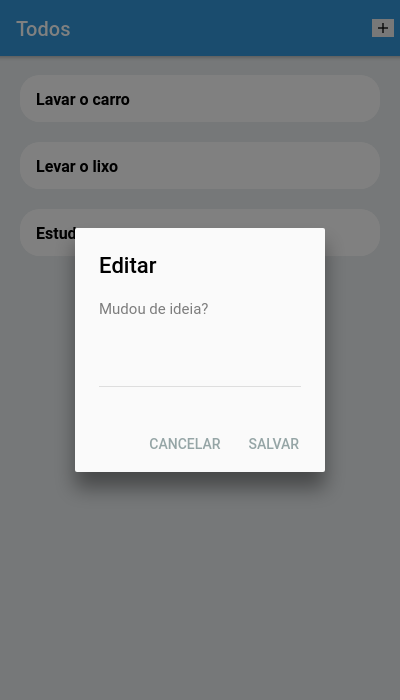

  Crud de tarefas tarefas utilizando ionic 3 e pouchdb

Clone o repo: **git clone https://github.com/JonasPequeno/crud-pouchdb-ionic3.git**  
Acesse a pasta do projeto: **cd crud-pouchdb-ionic3**  
Instale as dependências: **npm install**  
Para executar o app: **ionic serve** 

    
  
  

